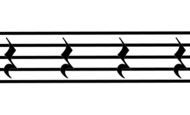
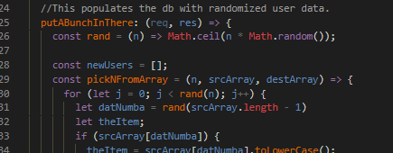

#  Ok, so here's what [Frender](https://frender-app.herokuapp.com/ "earlier version Heroku deploy") really is:

A nearly working MERN full-stack app.  
It's primarily a vanity piece because I wanted to create an animated guitar amp interface with React and some GIMP.  
So, I did, see?  

But it's also working behind the scenes.  
It authenticates users with Passport and bcrypt. 
It queries the database for musicians with similar tastes; and whose playing styles, experience, and instruments align with what the user is seeking, presented in a *Tinder-esque* manner.

It also has a nifty animated loading screen I made with [Animatron](https://www.animatron.com/) & [ScreenToGif](https://www.screentogif.com/).  

It can populate the database with a whole bunch of random users and/or delete them all, if you tweak it right.  

## How to work on this:
* Fork this repository.
* You'll need to get [Node.js](https://nodejs.org/en/)
* You'll also need to get [MongoDB]( https://www.mongodb.org/downloads)
* In a console, run `mongod`
* In another console in the root of this repo, run `yarn install`
  * then `yarn start`
  *you may have to `yarn add bcrypt` if it isn't validating user.
* It should open itself, but if not, in a browser, go to `localhost:3000`